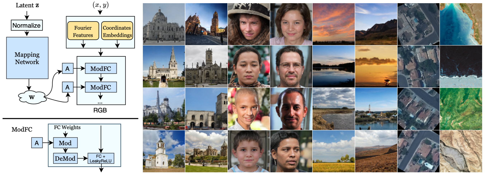
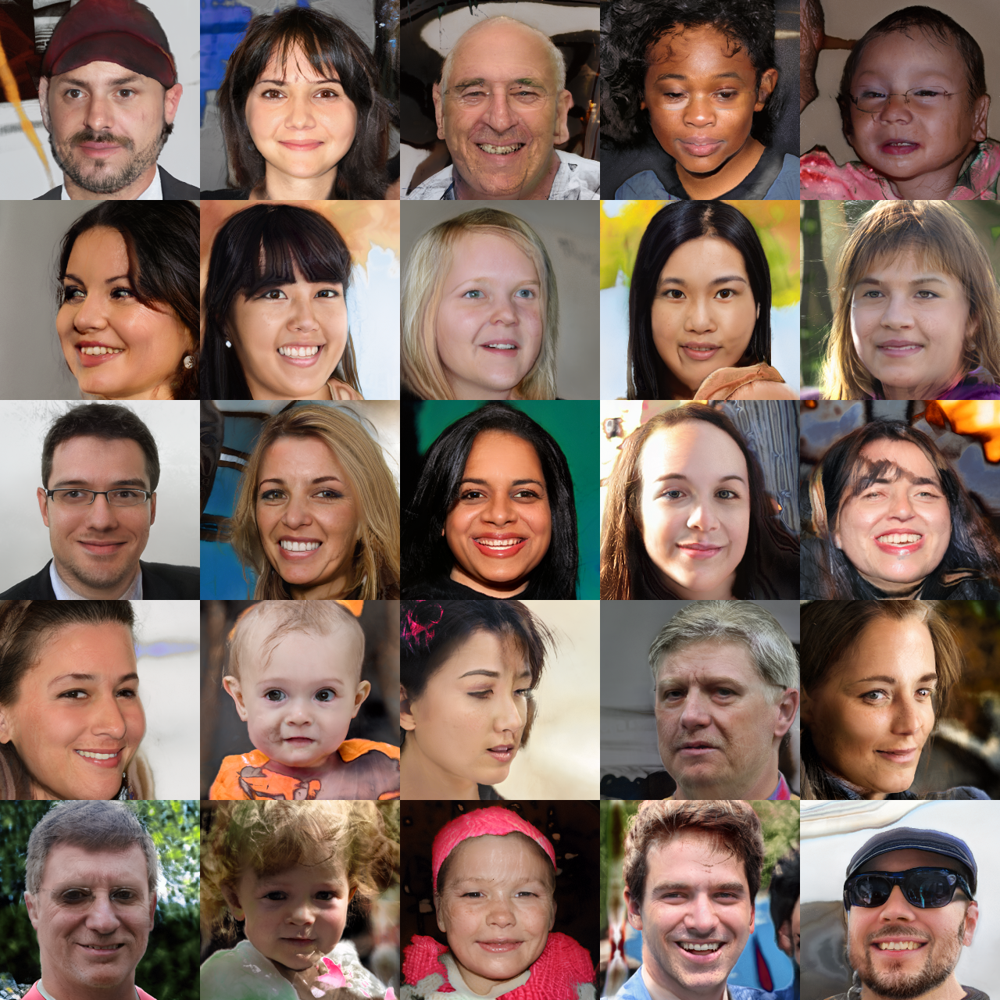

## CIPS &mdash; Simple TensorFlow Implementation [[Paper]](https://arxiv.org/abs/2011.13775)
### : Image Generators with Conditionally-Independent Pixel Synthesis (CVPR 2021, Oral)


<div align="center">
  
</div>

> **Abstract** *Existing image generator networks rely heavily on spatial convolutions and, optionally, self-attention blocks in order to gradually synthesize images in a coarse-to-fine manner. **Here, we present a new architecture for image generators, where the color value at each pixel is computed independently given the value of a random latent vector and the coordinate of that pixel.** No spatial convolutions or similar operations that propagate information across pixels are involved during the synthesis. We analyze the modeling capa- bilities of such generators when trained in an adversarial fashion, and observe the new generators to achieve similar generation quality to state-of-the-art convolutional generators. We also investigate several interesting properties unique to the new architecture.*

## Requirements
* `Tensorflow >= 2.x`

## Usage
```
├── dataset
   └── YOUR_DATASET_NAME
       ├── 000001.jpg 
       ├── 000002.png
       └── ...
```

### Train
```
> python main.py --dataset FFHQ --phase train --img_size 256 --batch_size 4 --n_total_image 4800
```

## Results
* **FID: 6.00 (4.8M images(150k iterations), 8GPU, each 4 batch size)**
  * FID reported in the paper: **6.31**

<div align="center">
  
</div>

## Reference
* [Official Pytorch](https://github.com/saic-mdal/CIPS)

## Author
[Junho Kim](http://bit.ly/jhkim_resume)
